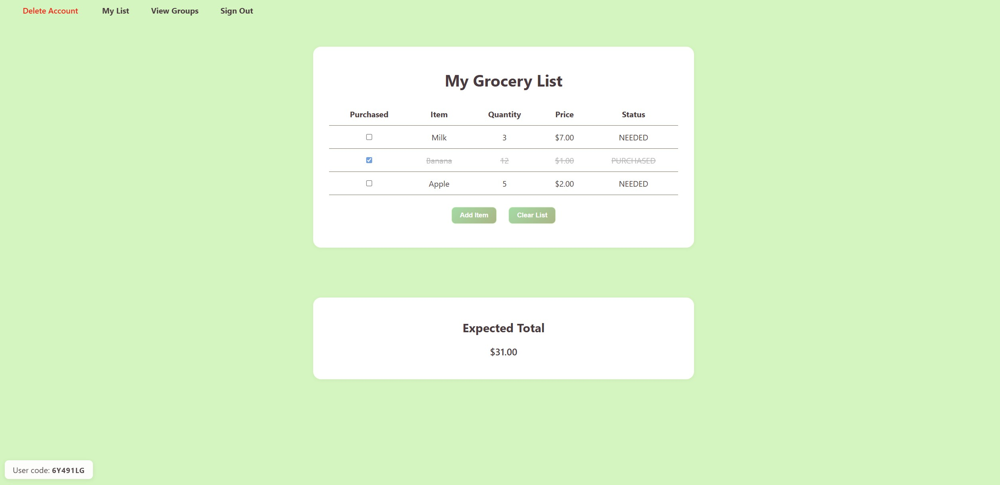

## Grocery Buddy : Shop, Share, and Stay Synced

### What is this project?
Grocery Buddy is a collaborative grocery and group list web application. It lets you create personal and shared lists, invite others to groups, track items, and manage your shopping together in real time.

### Tech Stack
- **Frontend:** React (Vite), Axios, CSS
- **Backend:** Node.js, Express, Prisma ORM, PostgreSQL, Socket.IO
- **Auth/Storage:** Supabase

### Features
- Create and manage personal and group lists
- Real-time updates for group lists
- Send and accept group invitations
- Track item quantities, prices, and status (needed/purchased)
- See expected totals for your lists
- Delete your account and all associated data


### Getting Started

1. **Clone the repository:**
	```bash
	git clone https://github.com/zawadtanzim/g-LIST.git
	cd g-LIST/main-folder/g-LIST
	```

2. **Backend setup:**
	```bash
	cd backend
	npm install
	# Set up your .env file (see .env.example if available)
	npx prisma migrate dev
	node server.js
	```

3. **Frontend setup (in a new terminal):**
	```bash
	cd frontend
	npm install
	npm run dev
	```

4. **Open the app:**
	- Visit the local URL shown in the terminal

5. **Sign up and start using Grocery Buddy!**


## How to Use
1. **Sign up** for an account
2. **Create a group** or join one using a group code
3. **Add items** to your personal or group lists
4. **Invite others** to your group or accept invitations
5. **Check off items** as you shop and see totals update in real time
6. **Delete your account** at any time from the navigation bar

### Contributors
- MD Zawad Tanzim ([LinkedIn](https://www.linkedin.com/in/zawadtanzim/))
- Ryan Thomas ([LinkedIn](https://www.linkedin.com/in/ryan-thomas-19a419197/))
- Latese Thompson ([LinkedIn](https://www.linkedin.com/in/latese-thompson-508a1a273/))
- Brenae Brooks ([LinkedIn](https://www.linkedin.com/in/brenae-b-9b7652294/))

